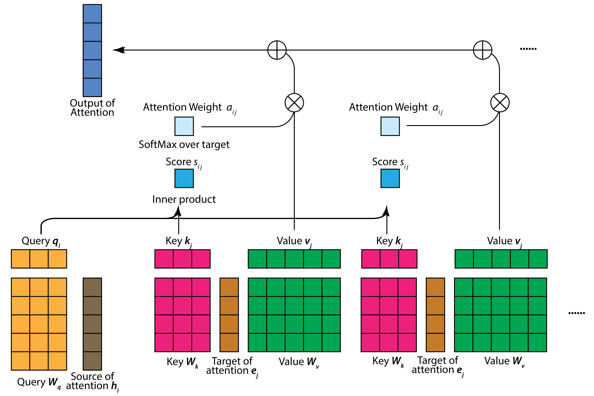

# TransformerFromScratch Tutorial Series

Binxu Wang (binxu_wang@hms.harvard.edu)

April. 17th, 2023

[Tutorial website](https://scholar.harvard.edu/binxuw/classes/machine-learning-scratch/materials/transformers) 

[Lecture slides (PDF)](https://scholar.harvard.edu/sites/scholar.harvard.edu/files/binxuw/files/mlfs_tutorial_nlp_transformer_ssl_updated.pdf)

**Transformer Jupyter Notebook Tutorial Series** 

* Fundamentals
  * [Understanding Attention & Transformer](https://colab.research.google.com/drive/1ZuhA6khlWm57WGZ8i38JH-gc5aJrvpvs?usp=sharing) (no GPU required)
     * [Tutorial on Einstein summation rules](https://colab.research.google.com/drive/1mizzN7iRlS2Du5TJvv7Wz7ecKOnpHzrQ?usp=sharing)
  * [Language modelling with transformer](https://colab.research.google.com/drive/1zZYzAopL__LW4glruSF9lnZYlEmSVI8j?usp=sharing) (CPU or GPU)
* Beyond Language 
  * **All the following notebooks include training transformer, shall be run with GPU runtime or the training takes too long.**
  * [Learn to do arithmetics by sequence modelling.](https://colab.research.google.com/drive/1vO71-o-8-3IrOe44Ha0nsHmUsEGVSC37?usp=sharing) (Simple, GPU Training ~ 10 min)
  * [Image generation by sequence modelling.](https://colab.research.google.com/drive/1UHlEbepqdvk68cYV1fvkmWl2TBKXfm8E?usp=sharing) (Simple, GPU Training ~ 10 ~ 20 min)
  * ~~[Audio signal classification](https://colab.research.google.com/drive/1O4XHOJyOu3_lyaPHAKJM_XTztrAb7VFP?usp=sharing) (Medium, GPU Training ~  20 min)~~ (WARNING: currently, there is a dependency install error, don't run on Colab.) 
  * [Image classification](https://colab.research.google.com/drive/1JDQQlLMGzo675AfrtkFn1kbuADtVemJz?usp=sharing) (Medium, GPU Training ~  30 min)
  * [Music generation by sequence modelling.](https://colab.research.google.com/drive/14zpzLpR4UBIzEQmeaXlMv_mDFYIv3Vht?usp=sharing) (Difficult, GPU Training takes hrs)
* Large Language Model
  * [OpenAI API and Chat with PDF](https://colab.research.google.com/drive/19mYEyavBhOnAbEQJQuztXAxWxyYbsQzi?usp=sharing) (Simple, no GPU needed, ~5mins)

